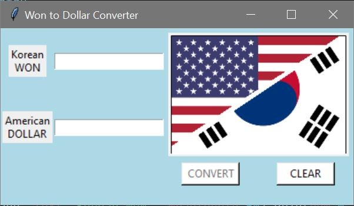

  
  <h1 align="center">KRW to USD Converter</h1>
  

    It converts Korean Won to American Dollar using real-time currency rate.

<!-- ABOUT THE PROJECT -->
## About The Project

### Built With

* Python
* Python - CurrencyConverter

<!-- GETTING STARTED -->
## The Process and What I have learned

### The Process

Since I'm from Korea, I always use the currency converter every month. Instead of looking up online every time, I created a simple program using the CurrnecyConverter library. 

